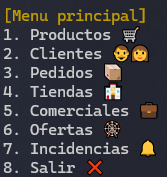
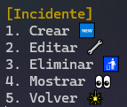

# Gestor de tiendas

Programa simple sobre la gestión de una cadena de tiendas, donde se pueden gestionar diferentes módulos, creado por Pablo Antonio López Butrón para la asignatura Sistemas de Gestión Empresarial:



    1. Productos (nombre, precio, stock)
    2. Clientes (nombre, email, telefono)
    3. Pedidos (cliente, prductos, fecha, estado)
    4. Tiendas (nombre, direccion, productos)
    5. Comerciales (nombre, clientes_asignados, ventas_realizadas)
    6. Ofertas (producto, descuento, fecha_inicio, fecha_fin)
    7. Incidencias (pedido, descripcion, fecha, estado)
    8. Salir 

## CRUD

Todos los módulos anteriores comparten un crud, donde se podrán crear, editar, eliminar o mostrar obejetos del módulo en cuestión.



    1. Crear
    2. Editar
    3. Eliminar
    4. Mostrar
    5. Volver

La funcíon es la siguiente, como vemos acepta cualquier tipo de clase, ademas de la lista específica del módulo.

```python
def crud(self, lista: List, tipo_clase: Producto | Cliente | Pedido | Tienda | Comercial | Oferta | Incidente) -> None
```

Por lo que para decidir que clase mandamos lo hacemos con dos bibliotecas, donde con la llave mandamos que lista queremos que modifique y que tipo queramos que sea.

```python
opciones_lista = {
    1: self.productos,
    2: self.clientes,
    3: self.pedidos,
    4: self.tiendas,
    5: self.comerciales,
    6: self.ofertas,
    7: self.incidencias,
}
clases_lista = {
    1: Producto,
    2: Cliente,
    3: Pedido,
    4: Tienda,
    5: Comercial,
    6: Oferta,
    7: Incidente,
}
                
if op in opciones_lista:
    self.crud(opciones_lista[op], clases_lista[op])
```

### 1. Crear

Para crear un nuevo objeto primero creamos uno vacio, luego, llamamos a su función modificar, que es compartida entre todas las clases, para modifcar el anterior objeto que estaria creado con valores por defecto. Asi nos ahorramos crear una función para crear y otra para modificar. 

```python
nuevo_objeto = tipo_clase()  
nuevo_objeto.modificar(self)     
lista.append(nuevo_objeto)
```

### 2. Editar

Para editar, pedimos el índice del objeto a modificar, que será indicado con anteriormente con la función mostrar, comprobamos que el índice es válido y llamamos, como anteriormente, a la función modificar.

```python
self.mostrar(lista)
print("Introduce indice a modificar: ")
try:
    indice = int(input()) - 1
    if 0 <= indice < len(lista):
        lista[indice].modificar(self)
    else:
        print(f"Indice fuera de rango.")
except ValueError:
    print(f"Debe de ser un numero.")
```

### 3. Eliminar

Para eliminar es exactamente igual que editar, pero en vez de llamar a modificar, eliminamos el índice de la lista con pop.

```python
self.mostrar(lista)
print("Introduce indice a eliminar: ")
try:
    indice = int(input()) - 1
    if 0 <= indice < len(lista):
        lista.pop(indice)
    else:
        print(f"Indice fuera de rango.")
except ValueError:
    print(f"Debe de ser un numero.")
```

### 4. Mostrar

Para mostrar la lista simplemente llamamos a la anteriormente mencionada función mostrar.

```python
def mostrar(self, lista: List) -> None:
    for i in range(len(lista)):
        print(f"{i + 1} - {lista[i]}")
```